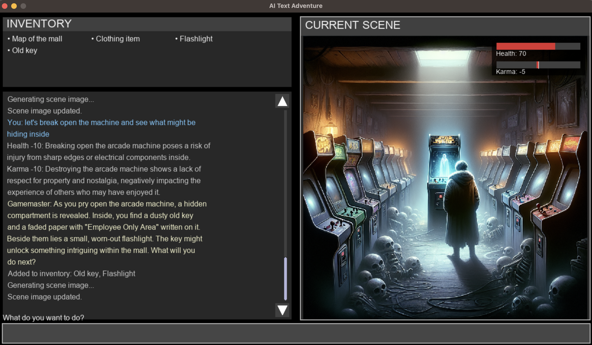

# AI Text Adventure

An immersive text-based role-playing game powered by AI that combines rich narrative storytelling with dynamically generated visuals. Every playthrough creates a unique adventure with emergent storylines and personalized experiences.



## Features

- **AI-Driven Narrative**: Dynamic storytelling powered by Large Language Models that responds to your choices and actions
- **Visual Scene Generation**: AI-generated images that illustrate your current scene and environment
- **Karma System**: Your choices have consequences, affecting how the world responds to you
- **Inventory Management**: Collect and use items throughout your adventure
- **Reincarnation Mechanic**: When you die, you're reborn into a new situation, carrying forward your experiences
- **Dynamic Events**: Unexpected encounters and challenges that test your adaptability
- **Modern UI**: Sleek interface with scrollable text history, visual health/karma indicators, and more

## Requirements

- Python 3.8 or higher
- PyGame 2.0.0 or higher
- An OpenAI API key for text and image generation

## Installation

1. Clone this repository:
   ```
   git clone <repository-url>
   cd ai_text_game
   ```

2. Install required dependencies:
   ```
   pip install -r requirements.txt
   ```

3. Set up your OpenAI API key:
   ```
   export OPENAI_API_KEY='your-api-key'
   ```
   
   On Windows:
   ```
   set OPENAI_API_KEY=your-api-key
   ```

## How to Play

1. Start the game:
   ```
   python main.py
   ```

2. Enter your character name when prompted.

3. Read the initial situation and start interacting with the world by typing commands.

4. Your actions will influence the story, your character's stats, and inventory.

5. When you die, you'll be reincarnated into a new scenario, starting fresh in a new scenario. Make careful choices though, your karma follows you.

## Game Elements

### Health
Your physical wellbeing, displayed in the red bar. Reaches zero when you die, which triggers reincarnation.

### Karma
Represents your moral standing in the world, ranging from -100 (negative) to 100 (positive). Affects how the world responds to you and influences random events.

### Inventory
Items you collect during your adventure. Use them by mentioning them in your commands.

### Narrative Elements
The game will occasionally introduce:
- **Choices**: Decision points that affect your path
- **Characters**: NPCs to interact with
- **Actions**: Sudden events requiring response
- **Items**: Objects to find or use

### Turbulence Events
Unexpected challenges that test your character. Their difficulty and lethality are influenced by your karma and past actions.

## Development

The game consists of several key components:

- `main.py`: Core game logic and loop
- `game_ui.py`: PyGame-based user interface
- `image_generator.py`: Handles AI image generation
- `situations.txt`: Contains possible starting scenarios

## Troubleshooting

### Image Generation Issues
- Ensure your OpenAI API key is valid and has sufficient credits
- Check your internet connection
- The game will continue to work without images if generation fails

## Credits

This game uses:
- OpenAI's API for text and image generation
- LangChain for streamlined AI interactions
- PyGame for rendering the user interface
- Built using Cursor.ai 

Enjoy your adventures in this AI-generated world! Each playthrough will be different, with emergent storylines and unexpected developments based on your choices. 